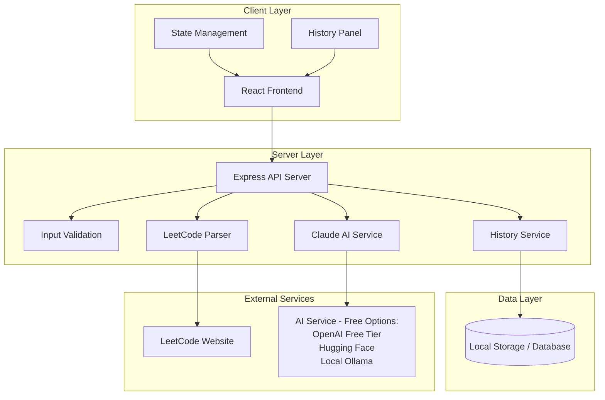

# Design Document: LeetCode Analysis Website

## Overview

The LeetCode Analysis Website is a single-page web application that provides AI-powered analysis of LeetCode solutions to help software engineering candidates prepare for technical interviews. The system integrates with Claude AI to offer four distinct analysis types: time complexity analysis, strategic hints, solution optimization, and debugging assistance.

The application follows a client-server architecture with a React frontend and Node.js/Express backend. The core workflow involves users inputting a LeetCode problem URL and their solution code, selecting an analysis type, and receiving AI-generated insights formatted for easy consumption.

## Architecture

### System Architecture



### Technology Stack

**Frontend:**
- React 18 with TypeScript for type safety and modern development
- Tailwind CSS for rapid, consistent styling
- React Query for server state management and caching
- Monaco Editor for code input with syntax highlighting

**Backend:**
- Python with FastAPI for the API server
- Pydantic for data validation and serialization
- SQLAlchemy with SQLite for history storage
- Requests and BeautifulSoup for web scraping
- APScheduler for background tasks (cleanup)
- Tenacity for retry logic and rate limiting

**Data Storage:**
- SQLite database for history storage (lightweight, no server setup required)
- Browser localStorage for temporary client-side caching
- No external database service required

**External Integrations:**
- **Primary AI Service**: Claude API (Anthropic) with Claude Sonnet 4.5 model
- **Fallback AI Service**: OpenAI GPT-4o-mini (cost-effective fallback)
- LeetCode website for problem metadata extraction (free web scraping)

**Cost Analysis:**
- **Hosting**: Deploy on Vercel/Netlify (free tier)
- **AI Analysis**: 
  - Claude API: Pay-as-you-go pricing (primary service)
  - OpenAI API: Pay-as-you-go pricing (fallback when Claude unavailable)
  - Estimated cost: $5-10/month for moderate personal use
- **Storage**: SQLite database (free, local file)
- **Total Monthly Cost**: ~$5-10 depending on usage

## Components and Interfaces

### Frontend Components

**App Component**
- Root component managing global state and routing
- Handles error boundaries and loading states
- Coordinates between input, analysis, and history components

**ProblemInput Component**
- Manages optional LeetCode URL input and validation
- Displays extracted problem information when URL is provided
- Handles problem link parsing and error states
- Clearly indicates that problem URL is optional
- Shows inferred problem information when analysis proceeds without URL

**CodeEditor Component**
- Monaco-based code editor with syntax highlighting
- Supports multiple programming languages
- Provides code validation and formatting

**AnalysisSelector Component**
- Renders four analysis option buttons
- Manages selection state and disabled states
- Provides visual feedback for active selection

**ResultsDisplay Component**
- Formats and displays AI analysis results
- Handles different result types (complexity, hints, optimization, debugging)
- For complexity analysis, shows Big O notation prominently with collapsible explanation section
- Provides copy-to-clipboard functionality
- Displays inferred problem information when no URL was provided

**HistoryPanel Component**
- Displays previously analyzed solutions organized by problem and date
- Provides filtering and search capabilities
- Allows selection of historical entries for review or re-analysis

**HistoryEntry Component**
- Renders individual historical analysis entries
- Shows problem title, date, analysis type, and summary
- Provides actions to view details or re-run analysis

### Backend Services

**LeetCodeParser Service**
```typescript
interface LeetCodeParser {
  extractProblemSlug(url: string): string | null;
  fetchProblemDetails(slug: string): Promise<ProblemDetails>;
  validateProblemUrl(url: string): boolean;
}

interface ProblemDetails {
  title: string;
  difficulty: 'Easy' | 'Medium' | 'Hard';
  description: string;
  constraints: string[];
  examples: Example[];
}
```

**AIService**
```typescript
interface AIService {
  analyzeTimeComplexity(problem: ProblemDetails | null, code: string): Promise<ComplexityAnalysis>;
  generateHints(problem: ProblemDetails | null, code: string): Promise<HintResponse>;
  optimizeSolution(problem: ProblemDetails | null, code: string): Promise<OptimizationResponse>;
  debugSolution(problem: ProblemDetails | null, code: string): Promise<DebugResponse>;
  checkSolutionCompleteness(code: string): Promise<CompletenessCheck>;
  inferProblemFromCode(code: string): Promise<ProblemInference>;
}

// Implementations available:
// - ClaudeService (uses Claude Sonnet 4.5 - primary service)
// - OpenAIService (uses GPT-5-mini - fallback service)

interface ProblemInference {
  inferredProblem: string;
  confidence: number;
  suggestedTitle?: string;
  reasoning: string;
}
```

**HistoryService**
```typescript
interface HistoryService {
  saveAnalysis(entry: HistoryEntry): Promise<void>;
  getHistory(userId?: string): Promise<HistoryEntry[]>;
  getHistoryByProblem(problemSlug: string): Promise<HistoryEntry[]>;
  deleteExpiredEntries(): Promise<void>;
  deleteEntry(entryId: string): Promise<void>;
}
```

**ValidationService**
```typescript
interface ValidationService {
  validateCode(code: string, language: string): ValidationResult;
  sanitizeInput(input: string): string;
  checkRateLimit(clientId: string): boolean;
}
```

### API Endpoints

**POST /api/analyze**
- Accepts problem URL, code, and analysis type
- Returns formatted analysis results
- Handles rate limiting and error responses

**GET /api/problem/:slug**
- Fetches problem details from LeetCode
- Returns structured problem information
- Caches results for performance

**GET /api/history**
- Retrieves user's analysis history for the past week
- Returns entries organized by problem and date
- Supports filtering and pagination

**GET /api/history/:problemSlug**
- Retrieves history for a specific problem
- Returns all entries for that problem within the time window
- Useful for comparing multiple attempts

**DELETE /api/history/:entryId**
- Allows users to manually delete specific history entries
- Returns confirmation of deletion
- Validates user ownership of the entry

**POST /api/validate**
- Validates code syntax and completeness
- Returns validation errors and suggestions
- Supports multiple programming languages

## Data Models

### Core Data Types

```typescript
interface AnalysisRequest {
  problemUrl?: string; // Optional - can be inferred from code
  code: string;
  language: string;
  analysisType: 'complexity' | 'hints' | 'optimization' | 'debugging';
}

interface AnalysisResponse {
  success: boolean;
  result?: AnalysisResult;
  error?: ErrorDetails;
  metadata: {
    processingTime: number;
    tokensUsed: number;
  };
}

interface ComplexityAnalysis {
  timeComplexity: string;
  spaceComplexity: string;
  explanation: string;
  keyOperations: string[];
  improvements?: string[];
  inferredProblem?: string; // Present when no problem URL was provided
}

interface HintResponse {
  hints: string[];
  progressive: boolean;
  nextSteps: string[];
}

interface OptimizationResponse {
  currentComplexity: string;
  optimizedComplexity: string;
  suggestions: OptimizationSuggestion[];
  codeExamples?: string[];
}

interface DebugResponse {
  issues: Issue[];
  fixes: Fix[];
  testCases: string[];
}

interface CompletenessCheck {
  isComplete: boolean;
  missingElements: string[];
  confidence: number;
}

interface HistoryEntry {
  id: string;
  problemSlug: string;
  problemTitle: string;
  code: string;
  language: string;
  analysisType: 'complexity' | 'hints' | 'optimization' | 'debugging';
  result: AnalysisResult;
  timestamp: Date;
  userId?: string;
}

interface HistoryResponse {
  entries: HistoryEntry[];
  totalCount: number;
  hasMore: boolean;
}
```

### Error Handling Models

```typescript
interface ErrorDetails {
  code: string;
  message: string;
  details?: any;
  suggestions?: string[];
}

interface ValidationResult {
  isValid: boolean;
  errors: ValidationError[];
  warnings: ValidationWarning[];
}
```

## Correctness Properties

*A property is a characteristic or behavior that should hold true across all valid executions of a system—essentially, a formal statement about what the system should do. Properties serve as the bridge between human-readable specifications and machine-verifiable correctness guarantees.*

Based on the prework analysis, here are the key correctness properties for the LeetCode Analysis Website:

**Property 1: URL Validation and Parsing**
*For any* string input, the system should correctly identify valid LeetCode URLs and extract problem details, while rejecting invalid URLs with descriptive error messages. When no URL is provided, the system should proceed with code-only analysis.
**Validates: Requirements 1.1, 1.2, 1.7**

**Property 2: Code Input Handling**
*For any* code input in supported programming languages, the system should accept, store, and validate the code before processing
**Validates: Requirements 1.3, 1.5, 9.3**

**Property 3: Input Validation Workflow**
*For any* combination of problem URL (optional) and solution code inputs, the system should validate inputs appropriately before allowing analysis to proceed. Code is required, but URL is optional.
**Validates: Requirements 1.4, 1.6, 1.7, 9.1**

**Property 4: Analysis Option Availability**
*For any* input state, analysis options should be enabled only when required inputs are provided, with appropriate guidance shown otherwise
**Validates: Requirements 2.3**

**Property 5: UI State Persistence**
*For any* sequence of UI interactions, user input data should be preserved when switching between analysis options or during analysis operations
**Validates: Requirements 2.4, 8.3**

**Property 6: Analysis Result Structure**
*For any* analysis request, the system should return results in the expected format with all required components (complexity notation, explanations, suggestions, etc.). For complexity analysis, results should separate the Big O notation from detailed explanations to support progressive disclosure.
**Validates: Requirements 3.1, 3.2, 3.3, 3.4, 3.5**

**Property 7: Hint Generation Quality**
*For any* hint request, the system should provide progressive hints that guide toward solutions without revealing complete implementations
**Validates: Requirements 4.1, 4.2, 4.3**

**Property 8: Optimization Analysis Completeness**
*For any* optimization request, the system should identify improvement areas and prioritize suggestions by complexity impact
**Validates: Requirements 5.1, 5.2, 5.4**

**Property 9: Debugging Analysis Precision**
*For any* debugging request, the system should identify specific issues with location information and provide concrete fix suggestions
**Validates: Requirements 6.1, 6.2, 6.3**

**Property 10: Solution Completeness Workflow**
*For any* incomplete solution, the system should allow hints but redirect other analysis types to completion suggestions with hint offers
**Validates: Requirements 10.1, 10.2, 10.3, 10.5**

**Property 11: AI Integration Reliability**
*For any* analysis request, the system should successfully integrate with Claude AI and handle service failures gracefully with appropriate error messages and retry mechanisms
**Validates: Requirements 7.1, 7.2, 7.3**

**Property 12: Response Formatting Consistency**
*For any* AI response received, the system should format and present results in a user-friendly, consistent manner
**Validates: Requirements 7.4, 8.4**

**Property 13: Error Handling Comprehensiveness**
*For any* error condition (network, validation, AI failure), the system should provide specific error messages with actionable guidance and recovery options
**Validates: Requirements 9.2, 9.4**

**Property 14: History Storage and Retrieval**
*For any* analysis performed, the system should store the entry and allow retrieval within the 1-week retention period, automatically cleaning up expired entries
**Validates: Requirements 11.1, 11.5**

**Property 15: History Organization and Display**
*For any* user's history, entries should be organized by problem and date, with grouped entries for the same problem to enable comparison
**Validates: Requirements 11.2, 11.6**

**Property 16: Historical Entry Interaction**
*For any* selected historical entry, the system should display the original problem, solution, analysis type, and results, with options to re-run analysis
**Validates: Requirements 11.3, 11.4**

**Property 17: Performance and Responsiveness**
*For any* analysis request, the system should provide loading indicators, complete within reasonable time limits, and cache results for improved performance
**Validates: Requirements 12.1, 12.2, 12.4**

**Property 18: Problem Inference from Code**
*For any* code input without a problem URL, the system should attempt to infer the LeetCode problem from code structure, method names, and logic patterns, providing the inferred problem information to the user
**Validates: Requirements 1.6, 1.7**

**Property 19: Complexity Display Progressive Disclosure**
*For any* complexity analysis result, the system should display Big O notation prominently while keeping detailed explanations in a collapsible/expandable section, allowing users to access details only when needed
**Validates: Requirements 3.2, 3.3, 3.5**

<function_calls>
<invoke name="prework">
<parameter name="featureName">leetcode-analysis-website

## Error Handling

### Error Categories and Responses

**Input Validation Errors**
- Invalid LeetCode URLs: Return specific format requirements and examples
- Malformed code: Provide syntax error details with line numbers
- Unsupported languages: List supported languages and suggest alternatives
- Missing required fields: Highlight specific missing inputs with guidance

**External Service Errors**
- LeetCode parsing failures: Retry with exponential backoff, fallback to manual input
- Claude API unavailable: Display service status and estimated recovery time
- Rate limiting: Show current limits and reset time, queue requests when possible
- Network timeouts: Provide retry options with progress indicators

**Analysis Processing Errors**
- Code too complex for analysis: Suggest breaking into smaller functions
- Ambiguous problem context: Request additional problem details or clarification
- AI analysis failures: Offer alternative analysis approaches or manual review options

### Error Recovery Strategies

**Graceful Degradation**
- When AI services fail, provide basic static analysis where possible
- Cache successful analyses to serve during service outages
- Offer offline mode with limited functionality for critical workflows

**User Guidance**
- Contextual help tooltips for common error scenarios
- Progressive disclosure of error details (summary → details → technical info)
- Suggested next steps for each error type with clear action buttons

## Testing Strategy

### Dual Testing Approach

The system requires both unit testing and property-based testing for comprehensive coverage:

**Unit Tests** focus on:
- Specific examples of valid/invalid inputs
- Edge cases in URL parsing and code validation
- Integration points between frontend and backend components
- Error conditions and recovery scenarios
- UI component behavior with known inputs

**Property-Based Tests** focus on:
- Universal properties that hold across all valid inputs
- Comprehensive input coverage through randomization
- Invariants that must be maintained during state transitions
- Round-trip properties for data serialization/deserialization

### Property-Based Testing Configuration

**Framework Selection:**
- Frontend: fast-check for TypeScript/JavaScript property testing
- Backend: fast-check for Node.js services
- Minimum 100 iterations per property test to ensure thorough coverage

**Test Tagging:**
Each property test must reference its design document property using the format:
**Feature: leetcode-analysis-website, Property {number}: {property_text}**

**Property Test Implementation:**
- Property 1: Generate various URL formats and test parsing behavior
- Property 2: Generate code in different languages and test acceptance
- Property 3: Generate input combinations and test validation workflow
- Property 4: Generate UI states and test option availability
- Property 5: Generate interaction sequences and test data persistence
- Property 6: Generate analysis requests and test result structure
- Property 7: Generate hint requests and test quality constraints
- Property 8: Generate optimization requests and test completeness
- Property 9: Generate debugging requests and test precision
- Property 10: Generate incomplete solutions and test workflow routing
- Property 11: Generate analysis requests and test AI integration reliability
- Property 12: Generate AI responses and test formatting consistency
- Property 13: Generate error conditions and test handling comprehensiveness
- Property 14: Generate analysis requests and test performance characteristics

### Integration Testing

**End-to-End Workflows:**
- Complete user journey from URL input to analysis results
- Error recovery scenarios with external service failures
- Performance testing under various load conditions
- Cross-browser compatibility testing

**API Testing:**
- Contract testing between frontend and backend
- Mock external services for reliable testing
- Rate limiting and throttling behavior validation
- Response time and caching effectiveness

### Test Data Management

**Synthetic Test Data:**
- Curated set of LeetCode problems with known characteristics
- Code samples with intentional bugs for debugging tests
- Solutions with known complexity characteristics for analysis validation
- Edge cases and boundary conditions for comprehensive coverage

**Property Test Generators:**
- URL generator with valid/invalid LeetCode URL patterns
- Code generator for multiple programming languages
- Problem description generator for context testing
- Error condition generator for failure scenario testing