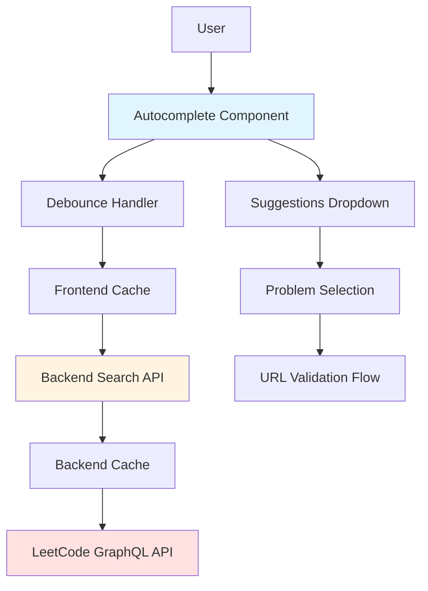

# Design Document: LeetCode Autocomplete Search

## Overview

This design document describes the implementation of a Google-style autocomplete search feature for the LeetCode Analysis Website. The feature enables users to search for LeetCode problems by typing problem names or keywords, receiving real-time suggestions powered by the LeetCode GraphQL API. This enhancement eliminates the need for users to manually find and paste problem URLs, significantly improving the user experience.

The implementation consists of three main components:
1. **Frontend Autocomplete Component** - A React/TypeScript component providing the search interface with dropdown suggestions
2. **Backend Search Service** - A Python FastAPI service that queries the LeetCode GraphQL API
3. **Debounce and Caching Layer** - Performance optimizations to minimize API calls and improve responsiveness

The design maintains backward compatibility with the existing URL input method while adding the new search functionality as an enhancement.

## Architecture

### System Components



### Data Flow

1. **User Input** → User types in the search field
2. **Debounce** → Wait 300ms after user stops typing
3. **Cache Check** → Check frontend cache for existing results
4. **API Request** → If not cached, send request to backend
5. **Backend Cache Check** → Backend checks its cache
6. **GraphQL Query** → If not cached, query LeetCode API
7. **Response Processing** → Parse and format results
8. **Display** → Show suggestions in dropdown
9. **Selection** → User selects a problem
10. **Auto-populate** → Fill in problem URL and validate

### Integration Points

- **ProblemInput Component**: Enhanced to support both URL input and search
- **Backend API**: New `/api/search-problems` endpoint
- **LeetCode GraphQL API**: Uses `problemsetQuestionList` query with filters
- **Existing Validation Flow**: Reuses existing URL validation after selection

## Components and Interfaces

### Frontend Components

#### 1. AutocompleteSearch Component

**Purpose**: Main component providing search input with autocomplete dropdown

**Props Interface**:
```typescript
interface AutocompleteSearchProps {
  onProblemSelect: (problemUrl: string, isValid: boolean) => void;
  placeholder?: string;
  className?: string;
}
```

**State Management**:
```typescript
interface AutocompleteState {
  searchQuery: string;
  suggestions: ProblemSuggestion[];
  isLoading: boolean;
  isOpen: boolean;
  selectedIndex: number;
  error: string | null;
}
```

**Key Methods**:
- `handleInputChange(value: string)`: Processes user input and triggers debounced search
- `handleKeyDown(event: KeyboardEvent)`: Handles arrow keys, Enter, and Escape
- `handleSuggestionClick(suggestion: ProblemSuggestion)`: Processes problem selection
- `closeSuggestions()`: Closes dropdown and resets state

#### 2. SuggestionItem Component

**Purpose**: Renders individual suggestion items in the dropdown

**Props Interface**:
```typescript
interface SuggestionItemProps {
  suggestion: ProblemSuggestion;
  isHighlighted: boolean;
  onClick: () => void;
  onMouseEnter: () => void;
}
```

**Rendering**:
- Problem number badge (colored by difficulty)
- Problem title (with search term highlighting)
- Difficulty indicator
- Hover and keyboard focus states

#### 3. useDebounce Hook

**Purpose**: Custom hook for debouncing search input

**Interface**:
```typescript
function useDebounce<T>(value: T, delay: number): T {
  const [debouncedValue, setDebouncedValue] = useState<T>(value);
  
  useEffect(() => {
    const handler = setTimeout(() => {
      setDebouncedValue(value);
    }, delay);
    
    return () => clearTimeout(handler);
  }, [value, delay]);
  
  return debouncedValue;
}
```

**Usage**: Delays API calls until user stops typing for 300ms

#### 4. Enhanced ProblemInput Component

**Purpose**: Wrapper component that supports both URL input and autocomplete search

**State**:
```typescript
interface ProblemInputState {
  inputMode: 'url' | 'search';
  url: string;
  isValid: boolean;
}
```

**Logic**:
- Detects if input starts with "http" → switches to URL mode
- Otherwise → uses search mode
- Maintains backward compatibility with existing URL validation

### Backend Components

#### 1. Search Service (`search_service.py`)

**Purpose**: Handles problem search queries to LeetCode GraphQL API

**Class Interface**:
```python
class SearchService:
    def __init__(self):
        self.session: requests.Session
        self.cache: Dict[str, Tuple[List[ProblemSuggestion], datetime]]
        
    async def search_problems(
        self, 
        query: str, 
        limit: int = 10
    ) -> List[ProblemSuggestion]:
        """Search for problems matching the query"""
        
    def _query_leetcode_api(
        self, 
        search_term: str, 
        limit: int
    ) -> Dict:
        """Execute GraphQL query to LeetCode"""
        
    def _parse_search_results(
        self, 
        data: Dict
    ) -> List[ProblemSuggestion]:
        """Parse GraphQL response into ProblemSuggestion objects"""
        
    def _get_cached_results(
        self, 
        query: str
    ) -> Optional[List[ProblemSuggestion]]:
        """Retrieve cached search results"""
        
    def _cache_results(
        self, 
        query: str, 
        results: List[ProblemSuggestion]
    ):
        """Cache search results with timestamp"""
```

**GraphQL Query**:
```graphql
query problemsetQuestionList($searchKeywords: String, $limit: Int, $skip: Int) {
  problemsetQuestionList: questionList(
    categorySlug: ""
    limit: $limit
    skip: $skip
    filters: {searchKeywords: $searchKeywords}
  ) {
    total: totalNum
    questions: data {
      difficulty
      frontendQuestionId: questionFrontendId
      title
      titleSlug
      paidOnly: isPaidOnly
    }
  }
}
```

**Variables**:
```json
{
  "searchKeywords": "two sum",
  "limit": 10,
  "skip": 0
}
```

#### 2. API Endpoint

**Route**: `POST /api/search-problems`

**Request Model**:
```python
class SearchRequest(BaseModel):
    query: str
    limit: int = 10
```

**Response Model**:
```python
class ProblemSuggestion(BaseModel):
    problem_id: str
    title: str
    title_slug: str
    difficulty: str
    is_paid_only: bool
    
class SearchResponse(BaseModel):
    suggestions: List[ProblemSuggestion]
    total: int
    query: str
```

**Error Handling**:
- 400: Invalid query (empty or too short)
- 429: Rate limit exceeded
- 500: LeetCode API error
- 503: Service unavailable

## Data Models

### Frontend Models

```typescript
// Problem suggestion returned from search
interface ProblemSuggestion {
  problemId: string;
  title: string;
  titleSlug: string;
  difficulty: 'Easy' | 'Medium' | 'Hard';
  isPaidOnly: boolean;
}

// Search cache entry
interface SearchCacheEntry {
  query: string;
  results: ProblemSuggestion[];
  timestamp: number;
}

// Autocomplete state
interface AutocompleteState {
  searchQuery: string;
  suggestions: ProblemSuggestion[];
  isLoading: boolean;
  isOpen: boolean;
  selectedIndex: number;
  error: string | null;
}
```

### Backend Models

```python
from pydantic import BaseModel
from typing import List, Optional
from datetime import datetime

class ProblemSuggestion(BaseModel):
    """A single problem suggestion from search results"""
    problem_id: str
    title: str
    title_slug: str
    difficulty: str
    is_paid_only: bool

class SearchRequest(BaseModel):
    """Request model for problem search"""
    query: str
    limit: int = 10
    
    @validator('query')
    def validate_query(cls, v):
        if len(v.strip()) < 2:
            raise ValueError('Query must be at least 2 characters')
        return v.strip()

class SearchResponse(BaseModel):
    """Response model for problem search"""
    suggestions: List[ProblemSuggestion]
    total: int
    query: str
    cached: bool = False

class SearchCacheEntry(BaseModel):
    """Cache entry for search results"""
    query: str
    results: List[ProblemSuggestion]
    timestamp: datetime
    total: int
```

### Cache Structure

**Frontend Cache** (in-memory):
```typescript
class SearchCache {
  private cache: Map<string, SearchCacheEntry>;
  private maxSize: number = 50;
  private ttl: number = 3600000; // 1 hour in ms
  
  get(query: string): ProblemSuggestion[] | null;
  set(query: string, results: ProblemSuggestion[]): void;
  clear(): void;
  private evictOldest(): void;
}
```

**Backend Cache** (in-memory with LRU):
```python
from collections import OrderedDict
from datetime import datetime, timedelta

class SearchCache:
    def __init__(self, max_size: int = 100, ttl_hours: int = 1):
        self.cache: OrderedDict[str, SearchCacheEntry] = OrderedDict()
        self.max_size = max_size
        self.ttl = timedelta(hours=ttl_hours)
    
    def get(self, query: str) -> Optional[List[ProblemSuggestion]]:
        """Get cached results if not expired"""
        
    def set(self, query: str, results: List[ProblemSuggestion], total: int):
        """Cache results with LRU eviction"""
        
    def clear(self):
        """Clear all cached entries"""
```


## Correctness Properties

A property is a characteristic or behavior that should hold true across all valid executions of a system—essentially, a formal statement about what the system should do. Properties serve as the bridge between human-readable specifications and machine-verifiable correctness guarantees.

### Property 1: Search Trigger Threshold

*For any* input string, the autocomplete component should trigger a search if and only if the string length is at least 2 characters, and should clear suggestions otherwise.

**Validates: Requirements 1.2, 1.3**

### Property 2: Input Mode Detection

*For any* input string, if the string starts with "http://" or "https://", the component should switch to URL validation mode and bypass search; otherwise it should use search mode.

**Validates: Requirements 1.4, 1.5**

### Property 3: Suggestion Display Completeness

*For any* problem suggestion displayed in the dropdown, the rendered HTML should contain the problem number, title, and difficulty level.

**Validates: Requirements 2.2**

### Property 4: Suggestion Count Limit

*For any* API response containing search results, the displayed suggestions should not exceed 10 items, regardless of how many results the API returns.

**Validates: Requirements 2.4**

### Property 5: Debounce Behavior

*For any* sequence of input changes, the debounce handler should wait 300ms after the last change before triggering a search, should reset the timer on each new input, and should trigger exactly one API call per debounce period.

**Validates: Requirements 3.1, 3.2, 3.3**

### Property 6: Request Cancellation

*For any* in-progress search request, if a new character is typed before the request completes, the previous request should be cancelled and a new debounced search should begin.

**Validates: Requirements 3.4**

### Property 7: GraphQL Query Structure

*For any* search query sent to the LeetCode API, the GraphQL query should include the fields: title, titleSlug, questionFrontendId, and difficulty.

**Validates: Requirements 4.2**

### Property 8: API Response Parsing

*For any* valid API response from LeetCode, the search service should parse it into a list of ProblemSuggestion objects with all required fields populated.

**Validates: Requirements 4.3**

### Property 9: Problem Selection Behavior

*For any* suggestion selected by the user, the component should populate the URL field with the correct LeetCode problem URL and mark the input as valid.

**Validates: Requirements 5.1, 5.2, 5.4**

### Property 10: Problem Details Caching

*For any* problem selected from suggestions, the component should fetch the problem details and store them in the cache for future use.

**Validates: Requirements 5.5**

### Property 11: Keyboard Navigation

*For any* list of suggestions, pressing the down arrow key should move the highlight to the next item (wrapping to the first when at the end), and pressing the up arrow key should move to the previous item (wrapping to the last when at the beginning).

**Validates: Requirements 6.1, 6.2, 6.5**

### Property 12: Keyboard Selection

*For any* highlighted suggestion, pressing the Enter key should select that suggestion and trigger the same behavior as clicking it.

**Validates: Requirements 6.3**

### Property 13: Exponential Backoff

*For any* rate limit error from the API, subsequent retry attempts should use exponentially increasing delays (e.g., 1s, 2s, 4s, 8s).

**Validates: Requirements 7.2**

### Property 14: Loading Indicator Timing

*For any* search request that takes longer than 500ms to complete, a loading indicator should be displayed to the user.

**Validates: Requirements 7.5**

### Property 15: Cache-First Strategy

*For any* search query, the search service should check the cache before making an API call, and should only call the API if no valid cached result exists.

**Validates: Requirements 8.1, 8.2**

### Property 16: Cache Expiration

*For any* cached search result, if the cache entry is older than 1 hour, the search service should fetch fresh results from the API and update the cache.

**Validates: Requirements 8.3, 8.4**

### Property 17: Cache Size Limit

*For any* state of the search cache, the total number of cached queries should not exceed 100 entries, with oldest entries being evicted when the limit is reached.

**Validates: Requirements 8.5**

### Property 18: Focus Management

*For any* keyboard navigation through suggestions, the component should maintain proper focus state and update ARIA attributes to announce the currently focused item to screen readers.

**Validates: Requirements 10.3, 10.4**

## Error Handling

### Frontend Error Handling

**Network Errors**:
- Display user-friendly message: "Unable to connect. Please check your internet connection."
- Log error details to console for debugging
- Allow user to retry search

**Empty Results**:
- Display "No problems found matching your search" message
- Suggest trying different keywords
- Provide example searches

**Rate Limiting**:
- Display message: "Too many searches. Please wait a moment and try again."
- Implement exponential backoff for retries
- Show countdown timer for when user can retry

**Timeout Errors**:
- Display message: "Search is taking longer than expected. Please try again."
- Cancel pending request
- Allow immediate retry

**Invalid Input**:
- Silently handle inputs shorter than 2 characters (no error message)
- Clear suggestions dropdown
- Maintain responsive UI

### Backend Error Handling

**LeetCode API Errors**:
```python
try:
    response = self.session.post(graphql_url, json=payload, timeout=10)
    response.raise_for_status()
except requests.Timeout:
    logger.error(f"LeetCode API timeout for query: {query}")
    raise HTTPException(
        status_code=504,
        detail={
            "error": "Search timeout",
            "message": "The search took too long to complete",
            "suggestion": "Please try again with a more specific search term"
        }
    )
except requests.HTTPError as e:
    if e.response.status_code == 429:
        logger.warning(f"Rate limited by LeetCode API")
        raise HTTPException(
            status_code=429,
            detail={
                "error": "Rate limit exceeded",
                "message": "Too many search requests",
                "suggestion": "Please wait a moment before searching again",
                "retry_after": 60
            }
        )
    else:
        logger.error(f"LeetCode API error: {e}")
        raise HTTPException(
            status_code=502,
            detail={
                "error": "Search service error",
                "message": "Unable to search problems at this time",
                "suggestion": "Please try again later"
            }
        )
except Exception as e:
    logger.error(f"Unexpected error during search: {e}")
    raise HTTPException(
        status_code=500,
        detail={
            "error": "Internal server error",
            "message": "An unexpected error occurred",
            "suggestion": "Please try again or contact support if the issue persists"
        }
    )
```

**Validation Errors**:
```python
@validator('query')
def validate_query(cls, v):
    if not v or len(v.strip()) < 2:
        raise ValueError('Search query must be at least 2 characters')
    if len(v) > 100:
        raise ValueError('Search query must not exceed 100 characters')
    return v.strip()
```

**Cache Errors**:
- Log cache errors but don't fail the request
- Fall back to API call if cache read fails
- Continue without caching if cache write fails

### Error Recovery Strategies

**Graceful Degradation**:
1. If cache fails → proceed with API call
2. If API fails → return empty results with error message
3. If parsing fails → log error and return empty results

**Retry Logic**:
- Automatic retry for transient network errors (max 3 attempts)
- Exponential backoff for rate limit errors
- No automatic retry for validation errors or 4xx responses

**User Feedback**:
- Always provide clear, actionable error messages
- Include suggestions for how to resolve the issue
- Maintain UI responsiveness even during errors

## Testing Strategy

### Dual Testing Approach

This feature will use both unit tests and property-based tests to ensure comprehensive coverage:

**Unit Tests**: Focus on specific examples, edge cases, and integration points
- Test specific search queries (e.g., "two sum", "binary tree")
- Test edge cases (empty results, single result, exactly 10 results)
- Test error conditions (network errors, rate limits, timeouts)
- Test UI interactions (clicking suggestions, keyboard navigation)
- Test integration between frontend and backend

**Property-Based Tests**: Verify universal properties across all inputs
- Generate random search queries and verify behavior
- Generate random suggestion lists and verify rendering
- Generate random timing sequences for debounce testing
- Generate random cache states and verify cache behavior
- Each property test should run minimum 100 iterations

### Frontend Testing

**Component Tests** (React Testing Library + Vitest):
```typescript
describe('AutocompleteSearch', () => {
  // Unit tests
  it('should display suggestions when typing valid query', async () => {
    // Test specific example
  });
  
  it('should handle empty results gracefully', async () => {
    // Test edge case
  });
  
  // Property-based tests
  it('Property 1: Search trigger threshold', async () => {
    // Feature: leetcode-autocomplete-search, Property 1
    // Generate random strings of various lengths
    // Verify search triggered only for length >= 2
  });
  
  it('Property 4: Suggestion count limit', async () => {
    // Feature: leetcode-autocomplete-search, Property 4
    // Generate random result sets of various sizes
    // Verify max 10 displayed
  });
});
```

**Hook Tests** (useDebounce):
```typescript
describe('useDebounce', () => {
  it('Property 5: Debounce behavior', async () => {
    // Feature: leetcode-autocomplete-search, Property 5
    // Generate random input sequences
    // Verify timing and single call behavior
  });
});
```

**Integration Tests**:
- Test complete flow from input to selection
- Test interaction with existing ProblemInput component
- Test cache integration
- Test error handling flows

### Backend Testing

**Service Tests** (pytest + hypothesis):
```python
class TestSearchService:
    # Unit tests
    def test_search_with_valid_query(self):
        """Test specific search query"""
        
    def test_search_with_empty_results(self):
        """Test edge case: no results"""
    
    # Property-based tests
    @given(st.text(min_size=2, max_size=50))
    def test_property_7_graphql_query_structure(self, query):
        """
        Feature: leetcode-autocomplete-search, Property 7
        For any search query, verify GraphQL includes required fields
        """
        
    @given(st.lists(st.builds(ProblemSuggestion), min_size=0, max_size=20))
    def test_property_8_api_response_parsing(self, mock_results):
        """
        Feature: leetcode-autocomplete-search, Property 8
        For any valid API response, verify correct parsing
        """
```

**Cache Tests**:
```python
class TestSearchCache:
    @given(st.text(min_size=2), st.lists(st.builds(ProblemSuggestion)))
    def test_property_15_cache_first_strategy(self, query, results):
        """
        Feature: leetcode-autocomplete-search, Property 15
        For any query, verify cache checked before API call
        """
        
    @given(st.integers(min_value=0, max_value=150))
    def test_property_17_cache_size_limit(self, num_entries):
        """
        Feature: leetcode-autocomplete-search, Property 17
        For any cache state, verify max 100 entries
        """
```

**API Endpoint Tests**:
- Test request validation
- Test response formatting
- Test error handling
- Test rate limiting behavior

### Property-Based Testing Configuration

**Frontend** (fast-check):
```typescript
import fc from 'fast-check';

// Configure for minimum 100 iterations
fc.assert(
  fc.property(
    fc.string({ minLength: 0, maxLength: 50 }),
    (searchQuery) => {
      // Property test logic
    }
  ),
  { numRuns: 100 }
);
```

**Backend** (hypothesis):
```python
from hypothesis import given, settings
import hypothesis.strategies as st

# Configure for minimum 100 iterations
@settings(max_examples=100)
@given(st.text(min_size=2, max_size=50))
def test_property(query):
    # Property test logic
    pass
```

### Test Coverage Goals

- **Unit Test Coverage**: 80%+ line coverage
- **Property Test Coverage**: All 18 correctness properties implemented
- **Integration Test Coverage**: All critical user flows
- **Edge Case Coverage**: All error conditions and boundary cases

### Testing Tools

**Frontend**:
- Vitest: Test runner
- React Testing Library: Component testing
- fast-check: Property-based testing
- MSW (Mock Service Worker): API mocking

**Backend**:
- pytest: Test runner
- hypothesis: Property-based testing
- pytest-mock: Mocking
- pytest-asyncio: Async testing

### Continuous Integration

- Run all tests on every pull request
- Require 80%+ coverage for merge
- Run property tests with increased iterations (500+) on main branch
- Monitor test execution time and optimize slow tests
